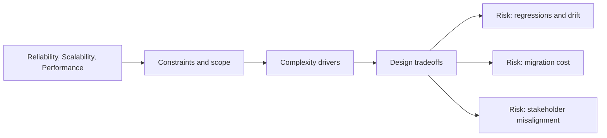

# Reliability, Scalability, Performance

@Metadata {
  @PageKind(article)
  @PageColor(gray)
  @TitleHeading("Reliability, Scalability, Performance")
  @PageImage(purpose: icon, source: "system-designs-system-design-dimensions-icon.codex", alt: "Reliability, Scalability, Performance icon")
  @PageImage(purpose: card, source: "system-designs-system-design-dimensions-card.codex", alt: "Reliability, Scalability, Performance card")
}

@Options {
  @AutomaticSeeAlso(disabled)
}

@Image(source: "system-designs-system-design-dimensions-hero.codex", alt: "Reliability, Scalability, Performance hero")

Document SLOs and performance expectations.

## Include

- Latency or throughput targets.
- Failure modes and recovery strategy.
- Capacity planning or scale limits.

## Diagram: Context Snapshot

@Image(source: "system-designs-system-design-dimensions-dimensions-reliability-scalability-performance-context.mermaid", alt: "Context snapshot")

