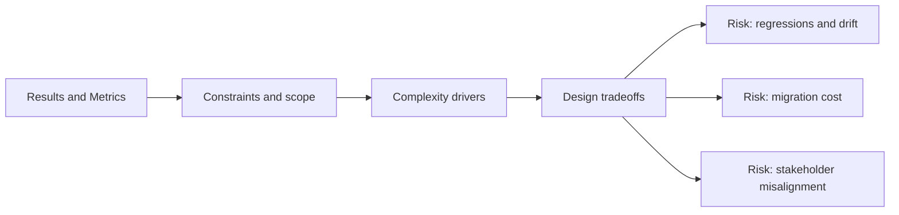

# Results and Metrics

@Metadata {
  @PageKind(article)
  @PageColor(gray)
  @TitleHeading("Results and Metrics")
  @PageImage(purpose: icon, source: "system-designs-system-design-dimensions-icon.codex", alt: "Results and Metrics icon")
  @PageImage(purpose: card, source: "system-designs-system-design-dimensions-card.codex", alt: "Results and Metrics card")
}

@Options {
  @AutomaticSeeAlso(disabled)
}

@Image(source: "system-designs-system-design-dimensions-hero.codex", alt: "Results and Metrics hero")

Show the measurable impact of the system design.

## Include

- Before/after metrics.
- User or business impact.
- Long-term maintenance wins.

## Diagram: Context Snapshot

@Image(source: "system-designs-system-design-dimensions-dimensions-results-and-metrics-context.mermaid", alt: "Context snapshot")

