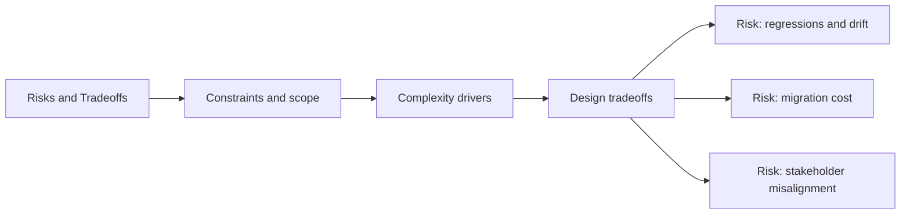

# Risks and Tradeoffs

@Metadata {
  @PageKind(article)
  @PageColor(gray)
  @TitleHeading("Risks and Tradeoffs")
  @PageImage(purpose: icon, source: "system-designs-system-design-dimensions-icon.codex", alt: "Risks and Tradeoffs icon")
  @PageImage(purpose: card, source: "system-designs-system-design-dimensions-card.codex", alt: "Risks and Tradeoffs card")
}

@Options {
  @AutomaticSeeAlso(disabled)
}

@Image(source: "system-designs-system-design-dimensions-hero.codex", alt: "Risks and Tradeoffs hero")

Make the decision logic explicit.

## Include

- Key tradeoffs and why they were acceptable.
- Alternative designs that were rejected.
- Risk mitigations and escape hatches.

## Diagram: Context Snapshot

@Image(source: "system-designs-system-design-dimensions-dimensions-risks-and-tradeoffs-context.mermaid", alt: "Context snapshot")

