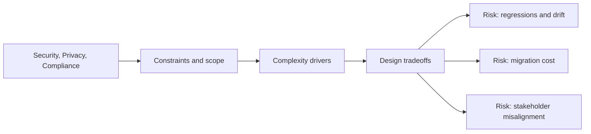

# Security, Privacy, Compliance

@Metadata {
  @PageKind(article)
  @PageColor(gray)
  @TitleHeading("Security, Privacy, Compliance")
  @PageImage(purpose: icon, source: "system-designs-system-design-dimensions-icon.codex", alt: "Security, Privacy, Compliance icon")
  @PageImage(purpose: card, source: "system-designs-system-design-dimensions-card.codex", alt: "Security, Privacy, Compliance card")
}

@Options {
  @AutomaticSeeAlso(disabled)
}

@Image(source: "system-designs-system-design-dimensions-hero.codex", alt: "Security, Privacy, Compliance hero")

Capture data handling, compliance risk, and guardrails.

## Include

- Threat model or abuse cases.
- Data retention, encryption, or access controls.
- Privacy and compliance requirements.

## Diagram: Context Snapshot

@Image(source: "system-designs-system-design-dimensions-dimensions-security-privacy-compliance-context.mermaid", alt: "Context snapshot")

