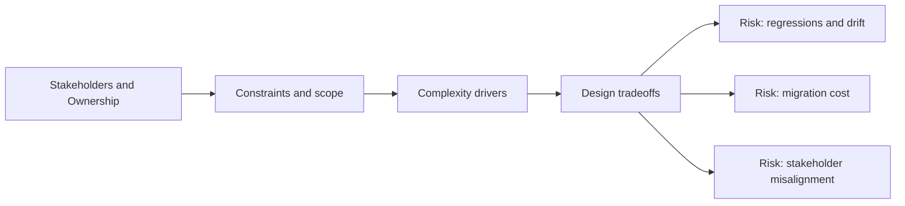

# Stakeholders and Ownership

@Metadata {
  @PageKind(article)
  @PageColor(gray)
  @TitleHeading("Stakeholders and Ownership")
  @PageImage(purpose: icon, source: "system-designs-system-design-dimensions-icon.codex", alt: "Stakeholders and Ownership icon")
  @PageImage(purpose: card, source: "system-designs-system-design-dimensions-card.codex", alt: "Stakeholders and Ownership card")
}

@Options {
  @AutomaticSeeAlso(disabled)
}

@Image(source: "system-designs-system-design-dimensions-hero.codex", alt: "Stakeholders and Ownership hero")

Clarify who owned which parts of the work and who depended on the outcome.

## Include

- Ownership boundaries and interfaces.
- Partner teams and their requirements.
- Decision-making and escalation paths.

## Diagram: Context Snapshot

@Image(source: "system-designs-system-design-dimensions-dimensions-stakeholders-and-ownership-context.mermaid", alt: "Context snapshot")

