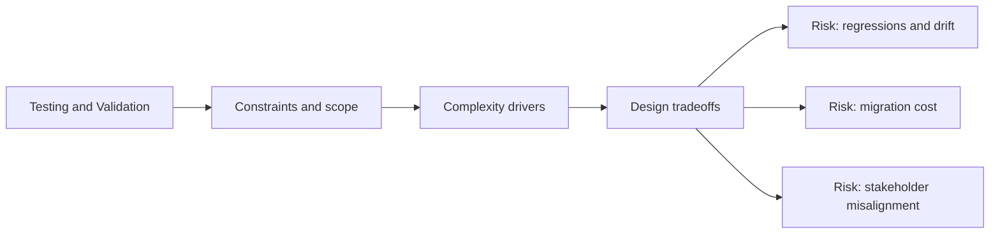

# Testing and Validation

@Metadata {
  @PageKind(article)
  @PageColor(gray)
  @TitleHeading("Testing and Validation")
  @PageImage(purpose: icon, source: "system-designs-system-design-dimensions-icon.codex", alt: "Testing and Validation icon")
  @PageImage(purpose: card, source: "system-designs-system-design-dimensions-card.codex", alt: "Testing and Validation card")
}

@Options {
  @AutomaticSeeAlso(disabled)
}

@Image(source: "system-designs-system-design-dimensions-hero.codex", alt: "Testing and Validation hero")

Explain how correctness was proven before and after launch.

## Include

- Test strategy and coverage.
- Validation steps or QA gates.
- Regression or snapshot tooling.

## Diagram: Context Snapshot

@Image(source: "system-designs-system-design-dimensions-dimensions-testing-and-validation-context.mermaid", alt: "Context snapshot")

