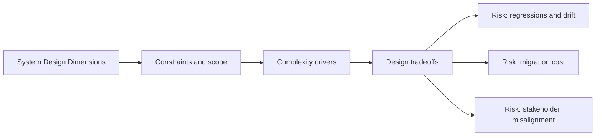

# System Design Dimensions

@Metadata {
  @PageKind(article)
  @PageColor(gray)
  @TitleHeading("System Design Dimensions")
  @PageImage(purpose: icon, source: "system-designs-system-design-dimensions-icon.codex", alt: "System Design Dimensions icon")
  @PageImage(purpose: card, source: "system-designs-system-design-dimensions-card.codex", alt: "System Design Dimensions card")
}

@Options {
  @AutomaticSeeAlso(disabled)
}

@Image(source: "system-designs-system-design-dimensions-hero.codex", alt: "System Design Dimensions hero")

A system design template organized as dimensions. Use it as a checklist for what
could matter, then select only the dimensions that fit your case study.

## How to Use

- Start with the executive summary and problem context.
- Add only the dimensions that change decisions or outcomes.
- Keep diagrams embedded in the dimension where they are discussed.

## Diagram: Context Snapshot

@Image(source: "system-designs-system-design-dimensions-system-design-dimensions-context.mermaid", alt: "Context snapshot")

## Topics

- <doc:system-designs/system-design-dimensions/dimensions-executive-summary>
- <doc:system-designs/system-design-dimensions/dimensions-problem-context>
- <doc:system-designs/system-design-dimensions/dimensions-goals-and-non-goals>
- <doc:system-designs/system-design-dimensions/dimensions-requirements-and-constraints>
- <doc:system-designs/system-design-dimensions/dimensions-stakeholders-and-ownership>
- <doc:system-designs/system-design-dimensions/dimensions-architecture-overview>
- <doc:system-designs/system-design-dimensions/dimensions-data-flows-and-interfaces>
- <doc:system-designs/system-design-dimensions/dimensions-risks-and-tradeoffs>
- <doc:system-designs/system-design-dimensions/dimensions-security-privacy-compliance>
- <doc:system-designs/system-design-dimensions/dimensions-reliability-scalability-performance>
- <doc:system-designs/system-design-dimensions/dimensions-observability-and-operations>
- <doc:system-designs/system-design-dimensions/dimensions-testing-and-validation>
- <doc:system-designs/system-design-dimensions/dimensions-migration-and-rollout>
- <doc:system-designs/system-design-dimensions/dimensions-results-and-metrics>
- <doc:system-designs/system-design-dimensions/dimensions-lessons-and-next-steps>
- <doc:system-designs/system-design-dimensions/dimensions-appendix-and-references>

